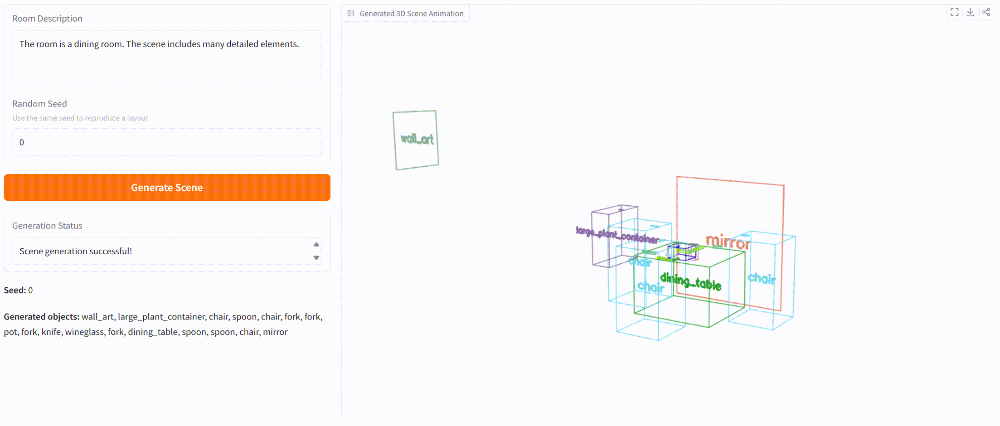

<h1 align="center">M3DLayout: A Multi-Source Dataset of 3D Indoor Layouts and Structured Descriptions for 3D Generation</h1>


<h4 align="center" style="line-height:1.4; margin-top:0.6rem">
  <a href="https://github.com/Graphic-Kiliani">Yiheng Zhang</a><sup>1*</sup>,
  <a href="https://www.caizhuojiang.com/">Zhuojiang Cai</a><sup>2*</sup>,
  <a href="https://openreview.net/profile?id=~Mingdao_Wang1">Mingdao Wang</a><sup>1*</sup>,
  <a href="https://openreview.net/profile?id=~Meitong_Guo1">Meitong Guo</a><sup>1</sup>,
  <a href="https://github.com/tingyunaiai9">Tianxiao Li</a><sup>1</sup>,
  <a href="https://xplorestaging.ieee.org/author/37088600614">Li Lin</a><sup>3</sup>,
  <a href="https://scholar.google.com/citations?user=KhFGpFIAAAAJ&hl=en">Yuwang Wang</a><sup>1†</sup>
</h4>

<p align="center" style="margin:0.2rem 0 0.6rem 0;">
  <sup>1</sup> Tsinghua University &nbsp;&nbsp;|&nbsp;&nbsp;
  <sup>2</sup> Beihang University &nbsp;&nbsp;|&nbsp;&nbsp;
  <sup>3</sup> Migu Beijing Research Institute
</p>

<p align="center" style="font-size:0.95em; color:#666; margin-top:0;">
  * Equal contribution &nbsp;&nbsp;|&nbsp;&nbsp; † Corresponding author
</p>

<p align="center">
  <a href="https://graphic-kiliani.github.io/M3DLayout/">
    
  </a>
  <a href="https://arxiv.org/abs/2509.23728">
      
  </a>
</p>


<p align="center">
    
</p>
</h4>


We have released our **Inference**, **Object Retrieval** and **Rendering** code, come and try it!!!
Other codes and datset will be released as soon as possible.

<p align="center">
    
</p>

## Installation
```bash
conda create -n m3dlayout python=3.10 -y
conda activate m3dlayout
conda install cuda -c nvidia/label/cuda-12.1.0 -y
pip install torch torchvision --index-url https://download.pytorch.org/whl/cu121
pip install -r requirements.txt --use-pep517 --no-build-isolation
```

## Download Weights
Please download the model weights from [Google Drive](https://drive.google.com/drive/folders/19GMTUk92fC6FB_dHu0aUw5Whc4j2KEWS?usp=drive_link) or [Baidu Netdisk](https://pan.baidu.com/s/1F4JtU0yxA6Zi7tYb5dcK5g?pwd=63w9), and place them in the `./weights` directory.

## Inference
To run the Gradio demo for 3d layout generation from arbitrary text:
```bash
python gradio_demo.py
```

## TODO
- [x] Release Object Retrieval code of M3DLayout
- [x] Release rendering code of layouts and scenes
- [x] Release inference code of M3DLayout
- [ ] Provide training instruction for M3DLayout
- [ ] Release M3DLayout dataset


## Citation
If you find our work helpful, please consider citing:
```bibtex
@article{zhang2025m3dlayout,
      title={M3DLayout: A Multi-Source Dataset of 3D Indoor Layouts and Structured Descriptions for 3D Generation}, 
      author={Yiheng, Zhang and Zhuojiang, Cai and Mingdao, Wang and Meitong, Guo and Tianxiao, Li and Li, Lin and Yuwang, Wang},
      journal={arXiv preprint arXiv:2509.23728},
      year={2025},
      url={https://arxiv.org/abs/2509.23728}, 
}
```

## Acknowledgements
Our code borrows from [ATISS](https://github.com/nv-tlabs/ATISS) and [DiffuScene](https://github.com/tangjiapeng/DiffuScene). We thank them for their excellent work. Please follow their licenses when using this part of the code.